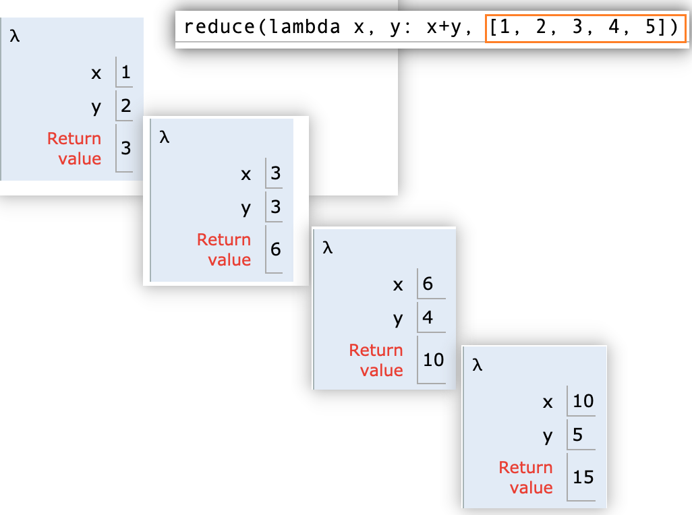

## 1. map, reduce, zip, filter 对序列操作
对指定序列做映射，返回值是迭代器


## 2. map
收获：
1. map(func, list_) 是一个迭代器，需要一个一个取，取一次运行一次，拿到一次值；
2. next: 可以取一次迭代器的值；如果取到最后没值了会抛出一个错；
3. list: 可以遍历取多次迭代器，直到取到所有值，并且存到list中；
4. list(map(func, list_)) 可以取代之前的旧写法，定义一个变量，type=list, 然后for循环取值append到这个变量list中；
5. list[func(x) for x in list_]  也可以稍微简写一下for循环；

**小补充： list还真是遍历多次迭代取值**
```python
nums = range(-5, 6)
print(nums)
print(type(nums))
print(list(nums))
"""
range(-5, 6)
<class 'range'>
[-5, -4, -3, -2, -1, 0, 1, 2, 3, 4, 5]
"""

```


### 2.1. map(func, iterables) 


map(function, *iterables)
对指定序列做映射，返回值是个迭代器，可迭代对象： list，set， tuple
map 取代for循环

list(map(function, *iteratbles))  == [function(iterable) for iterable in iterables]

### 2.2. 最常理解的实现是for循环，把结果收集到一个提前定义好的list中
```python
numbers = [2, 4, 6, 8, 5]
def square(x):
    return x * x
a= []
# 只会这么写，或者next
for x in numbers:
    a.append(square(x))
print(f"a: {a}")

b = [square(x) for x in numbers]
print(f"a: {a}")

"""
map(function, *iterables)
对指定序列做映射，返回值是个迭代器，可迭代对象： list，set， tuple
map 取代for循环
"""
```
    a: [4, 16, 36, 64, 25]
    b: [4, 16, 36, 64, 25]
### 2.3. 进阶： 使用map 简化掉for循环以及提前定义list

<mark>
list(map(func, list_))： 等于 for 循环取出 map得到的len(list_)个元素并且append到一个list中；

1. next 可以取出 map迭代器的值；
2. for 语句等同于 next的效果，挨个取出map迭代器的值；
3. list(map(func, list_)) 等于 point2 并且append到一个list中；
</mark>

#### 2.3.1. 举例 next 效果，更深刻理解list(map)的效果
```
numbers = [2, 4, 6, 8, 5]
def square(x):
    return x * x

# type: class map, object
square_num = map(square, numbers)
print(type(square_num))
print(square_num)
# 在list的时候调用了square_num，迭代5次，并且把每次迭代的return 都append进list中。
# 类似于next(square_num)了5次
# 也类似于for循环把每个迭代元素调用一次，得到的值加入到list中。
print(next(square_num))  #4
print(list(square_num))  # 因为上面next已经取走了第一个值，所以list这里只剩下4个值
```
    <class 'map'>
    <map object at 0x110a75c70>
    4
    [16, 36, 64, 25] 

#### 2.3.2. 举例 for循环取出值append到list中，用list(map)来取代for循环。
<mark>~~其实精简了两次for循环~~ 其实是map+list 两个动作 一起取代了 for循环和list.append
1. numbsers 和 square 用map来一一映射；
2. list(map) 达到了 一个一个for 并且 append的效果；
3. 啊哈哈哈 意外之喜，理解了另一个写法：b = [square(x) for x in numbers]
</mark>
<!--more-->

```python
numbers = [2, 4, 6, 8, 5]
def square(x):
    return x * x

# type: class map, object
square_num = map(square, numbers)
b = []
for x in square_num: #for 也是next的效果,在这一步，迭代器就被调用，返回值赋给了x
    print(type(x))
    print(x)
    b.append(x)
print(b)
```
    <class 'int'>
    4
    <class 'int'>
    16
    <class 'int'>
    36
    <class 'int'>
    64
    <class 'int'>
    25
    [4, 16, 36, 64, 25]

### 2.4. map 组合lambda 小复习

```python

numbers = [2, 4, 6, 8, 5]
def square(x):
    return x * x
print(list(map(square, numbers)))

print(list(map(lambda x: x*x, numbers)))

```
    [4, 16, 36, 64, 25]
    [4, 16, 36, 64, 25]


```python
numbers = [2, 4, 6, 8, 5]
numbers_2 = [2, 4, 6, 8, 5]
numbers_3 = [2, 4, 6, 8, 5]
def add(x,y,z):
    return x*y+z
print(list(map(add, numbers, numbers_2, numbers_3)))

print(list(map(lambda x, y, z: x*y+z, numbers, numbers_2, numbers_3)))
```
    [6, 20, 42, 72, 30]
    [6, 20, 42, 72, 30]


### 2.5. map 小应用

```bash
>>> list(map(str, [1, 2, 3, 4, 5, 6, 7, 8, 9]))
['1', '2', '3', '4', '5', '6', '7', '8', '9']
```

## 3. reduce

### 3.1. 对参数序列中的元素进行处理，返回一个值。看图理解

```python
from functools import reduce

# func函数必须有2个参数， sequence是一个序列， initial指初始值，default=None
reduce(function, sequence[, initial])

#满足了函数必须有2个参数，满足了序列  但是，怎么计算呢？
reduce(lambda x, y: x+y, [1, 2, 3, 4, 5])

```




### 3.2. reduce 小应用

```
>>> from functools import reduce
>>> def fn(x, y):
...     return x * 10 + y
...
>>> reduce(fn, [1, 3, 5, 7, 9])
13579
```

## 4. zip
4 zip(*iterable)

zip的功能是映射多个容器的相似索引，可以方便用于来构造字典

a=[1,2,3,4,5]b=["a","b","c","d","e"]c=dict(zip(b,a))print(c)

执行结果为：

{'a': 1, 'b': 2, 'c': 3, 'd': 4, 'e': 5}


## 5. yield

## 6. lambda

6 lambda表达式通常和map，filter，zip，reduce等结合起来一起用非常方便

下面看个例子

a=[1,2,3,4,5,6]print(list(map(lambda x:x*x,a)))

执行结果为：

[1, 4, 9, 16, 25, 36]


## 7. filter

滤掉不符合条件的元素，返回值是迭代器

    filter(function or None, iterable)


```python
nums = range(-5, 6)
print(list(nums))
# [-5, -4, -3, -2, -1, 0, 1, 2, 3, 4, 5]

# list 就等于 用for 遍历并存入list中，从nums中遍历取出每个元素来和None对比，-5是有值，为true，0 是false
# 没看懂，0 是False， 1是true，其他都不是None
print(list(filter(None, nums)))


nums = range(-5, 6)
print(list(nums))
# [-5, -4, -3, -2, -1, 0, 1, 2, 3, 4, 5]

    
for x in nums:
    if x != None:
        print(f"{x} is not None")
    if x == None:
        print(f"{x} is None")
    if x == True:
        print(f"{x} is True")
    if x == False:
        print(f"{x} is False")

```
    [-5, -4, -3, -2, -1, 0, 1, 2, 3, 4, 5]
    -5 is not None
    -4 is not None
    -3 is not None
    -2 is not None
    -1 is not None
    0 is not None
    0 is False
    1 is not None
    1 is True
    2 is not None
    3 is not None
    4 is not None
    5 is not None


```python
def demo_filter(x):
    return x % 4 != 0

#拿到 nums 中不能被 4 整除的整数
print(list(filter(demo_filter, nums)))  # 输出：[-5, -3, -2, -1, 1, 2, 3, 5]
```

