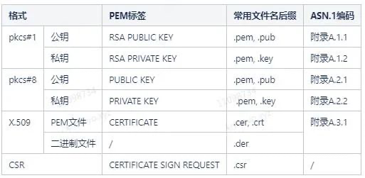

# openssl

在SSL/TLS/HTTPS通信中，证书虽然不是TLS/SSL协议的一部分，却是HTTPS非常关键的一环，网站引入证书才能避免中间人攻击。证书涉及了很多密码学知识，理解证书后，再深入理解TLS/SSL协议，效果会更好。

啥是TLS？？？Mutual TLS (mTLS) certificate authentication 双向证书认证

## 自签证书， CA、证书链、证书的撤销

Create 

```
openssl genrsa -out server.key 2048
openssl req -new -key server.key -out server.csr
openssl x509 -req -in server.csr -out server.crt -signkey server.key -days 3650
python3 manage.py runserver_plus --cert-file ./server.crt --key-file ./server.key 0.0.0.0:8000
```


1. Create a Certificate Authority private key (this is your most important key):

`openssl req -new -newkey rsa:1024 -nodes -out ca.csr -keyout ca.key`

2. Create your CA self-signed certificate:

`openssl x509 -trustout -signkey ca.key -days 365 -req -in ca.csr -out ca.pem`

3. Issue a client certificate by first generating the key, then request (or use one provided by external system) then sign the certificate using private key of your CA:
```
openssl genrsa -out client.key 1024
openssl req -new -key client.key -out client.csr
openssl ca -in client.csr -out client.cer
```


#### Manually stopping Pacific keycloak
`ps -ef | grep "/opt/keycloak" | awk '{print $2}' | xargs kill`


### 了解CA， root CA， 以及自签名，CA签名

只有root 是自签名，其他都是CA签名
ROOT证书是用来签发和验证CA证书的，防止在不知道签名者私钥的情况下恶意篡改证书的内容
Root CA -> Server CA -> Server(最终用户)

<mark>其实就是一个使用私钥签发（issue）的关系。</mark>
1.      ROOT 证书
2.                    的私钥
3.                            签发   `用私钥加过密的sign签名`, `签名算法，通常是Sha256WithHash`
4.                                 CA 证书
5.                                           签发
6.                                                 x.509证书（公钥证书), 以.cert, .crt后缀，是ASN.1编码 Abstract syntax notation dot one 抽象语法标记
> 秘钥和证书都是 SEQUENCE 类型，
> 而 SEQUENCE 的 type 是 0x30，且长度是大于 127 的，因此第2 个字节是 0x82.   
> ASN.1 编码表示的数据是二进制数据，通常通过 BASE64 转化成字符串保存在 pem 文件中，  
> 而 0x3082 经过 BASE64 编码后，就是字符串 MI，<mark>因此所有 PEM 文件存储的秘钥开始的前两个字符是 MI</mark>。

```bash
pkcs#1 用于定义 RSA 公钥、私钥结构
pkcs#7 用于定义证书链
pkcs#8 用于定义任何算法公私钥
pkcs#12 用于定义私钥证书
X.509 定义公钥证书
```





#### 看个keytool生成证书的范例


`keytool -genkeypair -storepass password -storetype PKCS12 -keyalg RSA -keysize 2048 -dname "CN=server" -alias server -ext "SAN:c=DNS:localhost,IP:127.0.0.1" -keystore conf/server.keystore`

-genkeypair  生成密钥对
```
Generates a key pair (a public key and associated private key).
              Wraps the public key into an X.509 v3 self-signed certificate,
              which is stored as a single-element certificate chain. This
              certificate chain and the private key are stored in a new
              keystore entry identified by alias.
```
-storepass 更改密钥库的存储口令,
-storetype   PKCS12 私钥证书
-keyalg      RSA, DSA, EC, DES, DESede
-keysize 
-dname
```
The dname value specifies the X.500 Distinguished Name to be
    associated with the value of alias, and is used as the issuer
    and subject fields in the self-signed certificate. If no
    distinguished name is provided at the command line, then the
    user is prompted for one.
```
-ext
-keystore
-validity
-keypass

```
SAN or SubjectAlternativeName
            Values: type:value(,type:value)*, where type can be EMAIL, URI,
            DNS, IP, or OID. The value argument is the string format value
            for the type.
```


##### genkeypair keyalg keysize
```bash
-genkeypair 生成密钥对      -keyalg算法   RSA             -keysize   2048  
                                         DSA                        1024 
                                         EC                         256
-genseckey 生成密钥          -keyalg      DES                        56   
                                         DESede                     168
 ```

##### ROOT证书

##### CA证书和

##### 使用CA证签发的X.509证书

