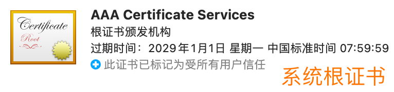

## 1. CA 简介 & 范例
**CA **= certificate authority签证机构
提供证书（服务器证书，由域名、公司信息、序列号和签名信息组成）

**SSL:** Secure Sockets Layer（安全套接层协议), 与HTTPS一起诞生
**TLS:** TLS，Transport Layer Security（传输层安全性协议）， 是SSL 标准化
<mark>**SSL & TLS： 本质是同一个东东**</mark>

**证书包含：**
1. public key、
1. 名称、 
1. <mark>CA的数字签名</mark>
1. 有效时间，
1. 签证机关的名称，
1. 该证书的序列号等信息


```bash
### 2.4. View the issued CA
```bash
CIAM-ali1:~/CAcerts # openssl x509 -text -noout -in server.pem
Certificate:
    Data:
        Version: 3 (0x2)
        Serial Number: 4096 (0x1000)
        Signature Algorithm: sha256WithRSAEncryption
        # 签证机构
        Issuer: C = CN, ST = Shanghai, L = Shanghai, O = Dell, OU = Dell
        #有效期
        Validity
            Not Before: Mar 27 08:22:59 2023 GMT
            Not After : Mar 26 08:22:59 2024 GMT
        # 名字    
        Subject: C = CN, ST = Shanghai, O = Dell, OU = Dell, CN = ciam-ali1.west.isilon.com
        #public key
        Subject Public Key Info:
            Public Key Algorithm: rsaEncryption
                RSA Public-Key: (2048 bit)
                Modulus:
                    00:e8:53:ef:bd:b0:e9:99:2b:af:35:da:2e:b5:81:
                    61:18:17:7a:7b:69:a0:46:c1:c2:ee:24:d7:36:52:
                    e9:5c:3d:49:ea:be:31:54:e0:a5:ff:a9:e1:19:b3:
                    81:8a:38:9e:a3:fa:62:23:b0:85:07:d1:35:3e:40:
                    7c:1a:68:1d:a8:6b:08:01:c8:95:d3:85:09:b0:7c:
                    60:85:dc:13:dc:91:a2:73:ee:f3:7e:42:80:99:24:
                    4f:09:13:91:9b:da:87:ee:ae:f2:ec:d9:9e:a6:75:
                    1d:e3:c6:cf:78:58:7d:2a:7e:8e:cf:65:30:60:ab:
                    42:6b:6d:76:f8:f2:46:de:c3:b5:4b:c9:60:39:24:
                    a0:5e:59:0c:b3:30:9e:3b:67:ae:d4:5f:53:6e:63:
                    47:92:dc:0c:39:9f:a6:39:b0:45:82:5b:e1:4d:a8:
                    ed:75:96:8a:98:32:49:f6:9b:a3:6e:69:91:f0:18:
                    2e:66:9e:ca:77:7e:b3:a6:96:d6:4a:e1:b1:51:a3:
                    1f:7d:d2:5f:41:ce:1c:02:c2:42:aa:b5:3b:61:1c:
                    9f:b9:45:70:fe:85:d0:d8:a3:6f:e5:e8:3d:9f:9e:
                    6d:53:57:f9:0f:0a:56:a4:f5:77:bb:4a:ff:fc:8a:
                    4a:67:e1:82:43:f1:7b:16:5a:80:1b:8f:da:f4:c4:
                    25:0d
                Exponent: 65537 (0x10001)
        X509v3 extensions:
            X509v3 Basic Constraints:
                CA:FALSE
            X509v3 Subject Key Identifier:
                D1:4F:3F:CD:DC:17:7E:50:38:A8:50:D6:EA:2C:BA:3D:6C:62:35:A1
            X509v3 Extended Key Usage:
                TLS Web Server Authentication
            X509v3 Subject Alternative Name:
                DNS:ciam-ali1.west.isilon.com
    Signature Algorithm: sha256WithRSAEncryption
         09:6b:25:4e:ca:a1:fc:2c:bb:35:5f:65:c8:47:92:7a:a1:53:
         b7:fd:6e:41:5a:39:32:35:87:b1:24:de:83:6e:23:6c:67:49:
         47:ba:91:de:7a:b1:81:f3:0a:3a:d3:25:35:13:6d:0f:d9:77:
         a4:6a:7e:a6:72:06:d9:b1:95:15:36:61:46:a4:b7:0f:16:c3:
         41:55:aa:e1:5c:93:28:4b:f0:9b:74:04:a1:08:59:97:23:c9:
         1b:17:d0:38:7d:74:e4:9a:42:e2:f7:0a:2d:01:8d:d3:7f:57:
         eb:b8:08:2e:fe:5f:b1:86:90:d2:97:64:9e:9a:61:51:06:9e:
         7c:25:a9:87:5c:63:e6:d5:18:9b:cb:0e:20:71:77:06:fd:2e:
         0f:c1:b9:21:75:34:ec:5a:11:4d:48:f8:4d:de:67:7a:f4:e6:
         3c:a1:4a:01:40:8f:ce:2c:c1:ae:5e:52:66:0d:6c:29:7b:f0:
         b3:ce:ae:b2:cf:13:d1:0e:ed:83:e3:15:16:5a:8c:ba:15:45:
         08:46:b6:63:92:66:ab:2c:2c:1c:f6:2c:34:d9:7d:9f:b6:d3:
         07:34:72:bb:89:81:27:d0:88:0f:b9:3e:e8:f2:3a:3c:7f:5c:
         88:88:1b:77:7a:41:a9:c9:99:2f:e5:76:87:8e:26:ec:85:c0:
         12:ac:02:25
CIAM-ali1:~/CAcerts #
```




**个人或组织提交CRS 给 CA 机构， CA签发**


## 2. SSL&TLS  安全套接协议
<MARK>SSL: Secure Sockets Layer（安全套接层协议), 与HTTPS一起诞生
TLS: TLS，Transport Layer Security（传输层安全性协议）， 是SSL 标准化
SSL & TLS： 本质是同一个东东</MARK>

> SSL是 Secure Sockets Layer（安全套接层协议）的缩写。由网景公司再1994年随HTTPS一起推出。
> 后交由IETF将SSL进行标准化，并改名为 TLS，Transport Layer Security（传输层安全性协议）。
> 所以 TLS 是 SSL 改个名而已，其实是一个东西。

### 2.1. SSL 分两层： record layer记录层 和 传输层
记录层： 确定传输层的封装格式
传输层： 使用x509认证
然后，用非对称加密算法来对双方进行身份认证
再然后，<mark>交换对称密钥，作为session key，</mark> 给通信双方的data做加密

### 2.2. SSL 证书有三种： DV, OV, EV

* DV（Domain Validation）域名验证型证书，面向个体用户，可以通过邮箱验证、DNS验证或者文件验证
* OV（Organization Validation）企业验证型证书，面向企业用户，CA 通过拨打信息库中公司的电话来确认；
* EV（Extended Validation）增强验证型证书，证书审核级别为所有类型最严格验证方式， 银行，金融。

## 3. openssl 安全套接字层密码库，实现自签名证书
> 可参考系列文章：
[openssl](https://angellaugh.github.io/2023/04/01/openssl/)
[openssl2:self-signed certificate](https://angellaugh.github.io/2023/03/28/openssl_2_signed/)

<!--more-->

### 3.1. OpenSSL 常用到的功能：密码算法，常用密钥，证书封装
1. 生成公钥，私钥；
1. 用公钥和私钥，加密，解密，签名，验证；
1. 生成x509 CA证书；
1. 各种证书的格式转换；
1. 对email签名和加密；
1. 时间戳；

### 3.2. OpenSSL一共实现了4种非对称加密算法，证书相关
1. DH算法一般用户密钥交换。
1. RSA 算法既可以用于密钥交换，也可以用于数字签名，
1. DSA算法则一般只用于数字签名
1. 椭圆曲线算法（EC）

```
pkcs#1 用于定义 RSA 公钥、私钥结构
pkcs#7 用于定义证书链
pkcs#8 用于定义任何算法公私钥
pkcs#12 用于定义私钥证书
X.509 定义公钥证书
-keyalg RSA, DSA, EC, DES, DESede
```

### 3.3. OpenSSL一共实现了8 种对称加密算法，用于在证书互信后，给交互data加密：
> 再然后，<mark>交换对称密钥，作为session key，</mark> 给通信双方的data做加密